<div align="center">
  

  # MCP Assistant

  **A powerful, browser-based MCP (Model Context Protocol) client for seamless remote server access**

  [](https://mcp-assistant.in)
  [](LICENSE)
</div>

---

## 🎯 What is MCP Assistant?

**MCP Assistant** is a lightweight, web-based client that revolutionizes how developers interact with the Model Context Protocol (MCP). It provides a unified interface to connect, manage, and execute tools from multiple remote MCP servers without any local setup.

### Why MCP Assistant?

Traditional MCP workflows require complex local configurations, CLI tools, and manual OAuth handling. MCP Assistant eliminates these pain points:

| Traditional MCP | With MCP Assistant |
|----------------|-------------------|
| ❌ Manual server configuration | ✅ Visual server management |
| ❌ Complex OAuth token handling | ✅ Automated OAuth flows |
| ❌ Local installation required | ✅ Works in any browser |
| ❌ Single server limitation | ✅ Multi-server orchestration |
| ❌ CLI-based interaction | ✅ Intuitive chat interface |

---

## ✨ Key Features

### 🔌 **Model Context Protocol (MCP) Integration**

- **🌐 Multi-Transport Support**: Connect via SSE (Server-Sent Events) or Streamable HTTP
- **🔐 Enterprise Authentication**: Built-in OAuth 2.0 (RFC8414) and OpenID Connect Discovery
- **📡 Multi-Server Management**: Connect and orchestrate multiple MCP servers simultaneously
- **⚡ Real-time Monitoring**: Live status tracking and health checks for all connections
- **🛠️ Native Tool Execution**: Direct tool discovery and execution from connected servers

### 🤖 **AG-UI Protocol (Agent-User Interaction)**

- **💬 Real-time Streaming**: Sub-second message streaming for fluid conversations
- **🎨 Rich Visualizations**: Advanced backend-driven tool output rendering
- **📊 Interactive Logs**: Live execution logs and tool result streaming
- **👤 Human-in-the-Loop**: Pause, inspect, and approve AI workflows with persistent state
- **🧠 Intelligent Context**: Smart context sharing between client and MCP tools

### 🎪 **Additional Capabilities**

- **🎨 Modern UI**: Beautiful, responsive interface with dark mode support
- **🔍 Tool Explorer**: Browse and test tools from all connected servers
- **📝 LLM Provider Support**: Works with OpenAI, Anthropic, and other major providers
- **🔒 Secure by Default**: API keys never leave your browser
- **📱 Cross-Platform**: Works on desktop, tablet, and mobile browsers

---

## 🏗️ Architecture

MCP Assistant follows a clean, modular architecture optimized for performance and scalability:

```mermaid
flowchart TD
    subgraph Browser["🌐 Browser"]
        B[User Interface]
    end

    subgraph MCPA["🚀 MCP ASSISTANT"]
        subgraph UI["Frontend"]
            direction TB
            MAR["MCP Registry"]
            MPR["Protocol Registry"]
            PG["Playground"]
        end

        subgraph Backend["⚙️ Backend Services"]
            LA["LangGraph Agent"]
            DB[("💾 Database")]
        end
    end

    subgraph External["🌍 External Services"]
        MCP_IO["modelcontextprotocol.io"]
    end

    subgraph Tools["🛠️ MCP Servers"]
        SERVER1["Context7"]
        SERVER2["Deepwiki"]
        SERVER3["Custom Servers"]
    end

    B -- "HTTPS" --> UI
    MAR -- "GraphQL" --> DB
    PG -- "Execute" --> LA
    MPR -- "HTTPS" --> MCP_IO
    PG -- "AG-UI Protocol
    (MCP server info)" --> LA
    UI -- "SSE / MCP Protocol" --> Tools
    LA -- "SSE / Streamable HTTP" --> Tools
```



---

## 📖 How to Use

### 1️⃣ **Connect to an MCP Server**

<div align="center">
  
</div>

1. Navigate to the **MCP Servers** page
2. Click **"Add Server"**
3. Configure your server:
   - **Name**: Friendly identifier (e.g., "My GitHub Tools")
   - **Transport**: Choose SSE or Streamable HTTP
   - **URL**: Your MCP server endpoint
   - **OAuth2** (Optional): Configure for authenticated servers

### 2️⃣ **Start Chatting with AI**

<div align="center">
  
</div>

1. Open the **Playground**
2. Select connected MCP servers from the sidebar
3. Choose your LLM provider (OpenAI, Anthropic, etc.)
4. Enter your API key
5. Start asking questions—the AI will automatically use tools from your MCP servers!

### 3️⃣ **Explore Available Tools**

Browse all tools from connected servers, view their schemas, and test them directly in the interface.

---

## 🎓 Use Cases

### For Developers

- **Testing MCP Servers**: Quickly validate your MCP server implementations
- **Tool Discovery**: Explore available tools across multiple MCP servers
- **Integration Development**: Build and test MCP integrations without local setup

### For Teams

- **Centralized Access**: Share MCP server configurations across team members
- **Multi-Server Workflows**: Orchestrate tools from different MCP providers
- **OAuth Management**: Simplify complex authentication workflows

### For AI Enthusiasts

- **Experiment with Tools**: Connect AI models to real-world tools and APIs
- **Human-in-the-Loop**: Review and approve AI actions before execution
- **Custom Workflows**: Build sophisticated multi-step AI workflows

---

## 🔧 Configuration

### Environment Variables

Create a `.env.local` file in the root directory:

```env
# Add your configuration here
NEXT_PUBLIC_API_URL=your_api_url
```

### MCP Server Configuration

Servers can be configured via the UI or programmatically. See the [MCP Configuration Guide](lib/mcp/README.md) for detailed instructions.

---

## 🛣️ Roadmap

- [ ] **v0.3.0**: Enhanced tool visualization and debugging
- [ ] **v0.4.0**: Workflow automation and scheduling
- [ ] **v0.5.0**: Team collaboration features
- [ ] **v1.0.0**: Enterprise-ready deployment options

---

## 🤝 Contributing

We welcome contributions from the community! Here's how you can help:

1. **Fork the repository**
2. **Create a feature branch**: `git checkout -b feature/amazing-feature`
3. **Commit your changes**: `git commit -m 'Add amazing feature'`
4. **Push to the branch**: `git push origin feature/amazing-feature`
5. **Open a Pull Request**

### Development Guidelines

- Follow the existing code style
- Write meaningful commit messages
- Add tests for new features
- Update documentation as needed

---

## 📜 License

This project is licensed under the MIT License - see the [LICENSE](LICENSE) file for details.

---

## 🙏 Acknowledgments

- [Model Context Protocol](https://modelcontextprotocol.io) for the amazing protocol
- [Anthropic](https://anthropic.com) for pioneering the MCP ecosystem
- All contributors and early adopters who helped shape this project

---

<div align="center">
  <p>Made with ❤️ by the MCP Assistant team</p>
</div>
