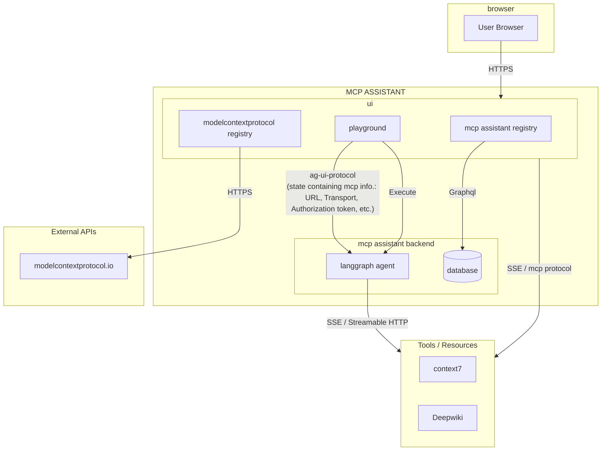

  
  <h1>MCP Assistant</h1>
  
<strong>A Web Based MCP Client to access remote MCP's</strong>

  
  
  
  

## 🎯 Purpose

MCP Assistant addresses common pain points developers face when working with the Model Context Protocol:

- **Remote MCP Access**: Enables seamless connection to remote MCP servers via SSE and Streamable HTTP transports
- **OAuth Complexity**: Handles complex OAuth 2.0 authorization flows automatically, eliminating the need for manual token management
- **Multi-Server Management**: Manage and interact with multiple MCP servers simultaneously without juggling between different CLI tools or configurations
- **No Local Setup Required**: Access MCP servers from anywhere through a web interface - no need to install or configure MCP servers locally
- **Universal Compatibility**: Works with any MCP server that supports SSE or HTTP streaming, providing a unified interface regardless of the underlying implementation
- **Developer-Friendly**: Built-in tools explorer, real-time connection monitoring, and intuitive UI make MCP development easier

Whether you're building MCP integrations, testing MCP servers, or simply exploring the MCP ecosystem, MCP Assistant streamlines the entire workflow.

## 🌟 Features & Capabilities

### 🔌 Model Context Protocol (MCP)
- **Multi-Transport Support**: Seamless connections via SSE and Streamable HTTP.
- **Dynamic Management**: Configure and manage multiple remote servers simultaneously.
- **Enterprise Auth**: Built-in support for OAuth 2.0 (RFC8414) and OpenID Connect Discovery.
- **Live Monitoring**: Real-time status tracking for all connected MCP instances.
- **Direct Execution**: Native tool discovery and execution environment.

### 🤖 Agent–User Interaction (AG-UI)
- **Real-time Streaming**: Sub-second text message event streaming for fluid chats.
- **Rich Tool Rendering**: Advanced backend-driven visualization for tool outputs.
- **Interactive Logs**: Stream tool results and execution logs as live events.
- **Human-in-the-Loop**: Pause, inspect, and approve workflows with persistent state.
- **Shared Context**: Intelligent context sharing between the client and MCP tools.

---

## 🏗️ Architecture Overview

MCP Assistant is built to be fast, secure, and easy to use, making it simple to connect and interact with all your tools in real-time.

---

## 🚀 Getting Started with MCP Assistant

### 🔌 Adding an MCP Server

1. **Navigate** to the MCP servers page.
2. Click the **"Add Server"** button.
3. **Fill in** the server details:
   - **Server Name**: A friendly name for your server.
   - **Transport Type**: Choose between SSE or Streamable HTTP.
   - **Server URL**: The endpoint of your MCP server.
   - **OAuth2 Configuration** (Optional): If your server requires authentication.
4. Click **"Save"** to establish the connection.

### 💬 Using the Chat Interface

1. **Select** one or more connected MCP servers from the sidebar.
2. **Choose** your preferred LLM provider.
3. **Enter** your API key securely.
4. **Start Chatting**: The assistant is now ready to use tools from your connected MCP servers!

---

## 🤝 Contributing

Contributions are welcome! Please feel free to submit a Pull Request.

